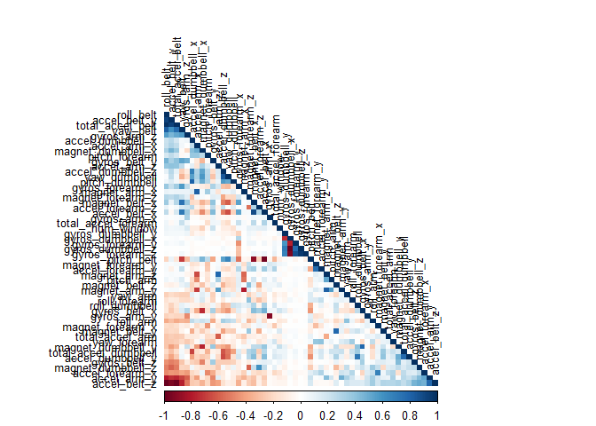
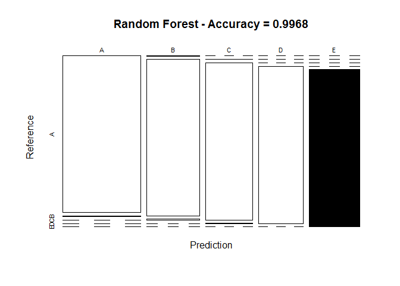
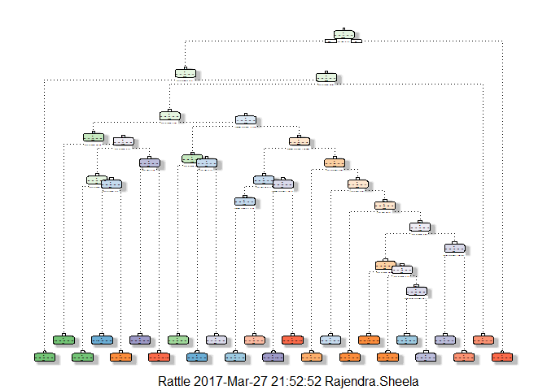
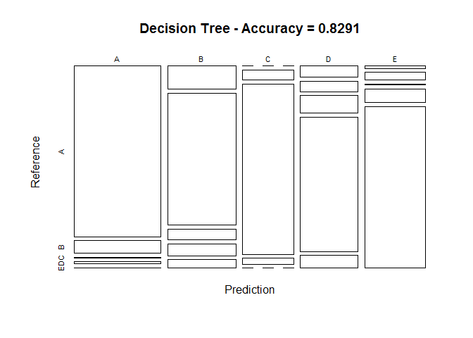

Overview
========

This document is the final report of the Peer Assessment project from
Coursera's course Practical Machine Learning, as part of the
Specialization in Data Science. It was built in RStudio, using its knitr
functions, meant to be published in html format. This analysis meant to
be the basis for the course quiz and a prediction assignment writeup.
The main goal of the project is to predict the manner in which 6
participants performed some exercise as described below. This is the
"classe" variable in the training set. The machine learning algorithm
described here is applied to the 20 test cases available in the test
data and the predictions are submitted in appropriate format to the
Course Project Prediction Quiz for automated grading.

Background
----------

Using devices such as Jawbone Up, Nike FuelBand, and Fitbit it is now
possible to collect a large amount of data about personal activity
relatively inexpensively. These type of devices are part of the
quantified self movement - a group of enthusiasts who take measurements
about themselves regularly to improve their health, to find patterns in
their behavior, or because they are tech geeks. One thing that people
regularly do is quantify how much of a particular activity they do, but
they rarely quantify how well they do it. In this project, your goal
will be to use data from accelerometers on the belt, forearm, arm, and
dumbell of 6 participants. They were asked to perform barbell lifts
correctly and incorrectly in 5 different ways. More information is
available from the website here:
\[<http://groupware.les.inf.puc-rio.br/har>\]<http://groupware.les.inf.puc-rio.br/har>
(see the section on the Weight Lifting Exercise Dataset).

Loading and Processing the Raw Data
-----------------------------------

The data for this project come from this source

The training data for this project are available here:

<https://d396qusza40orc.cloudfront.net/predmachlearn/pml-training.csv>

The test data are available here:

<https://d396qusza40orc.cloudfront.net/predmachlearn/pml-testing.csv>

### Data loading

The next step is loading the dataset from the URL provided above. The
training dataset is then partinioned in 2 to create a Training set (70%
of the data) for the modeling process and a Test set (with the remaining
30%) for the validations. The testing dataset is not changed and will
only be used for the quiz results generation.

    library(knitr)

    ## Warning: package 'knitr' was built under R version 3.3.3

    library(caret)

    ## Warning: package 'caret' was built under R version 3.3.3

    ## Loading required package: lattice

    ## Warning: package 'lattice' was built under R version 3.3.3

    ## Loading required package: ggplot2

    library(rpart)

    ## Warning: package 'rpart' was built under R version 3.3.3

    library(rpart.plot)

    ## Warning: package 'rpart.plot' was built under R version 3.3.3

    library(rattle)

    ## Warning: package 'rattle' was built under R version 3.3.3

    ## Rattle: A free graphical interface for data mining with R.
    ## Version 4.1.0 Copyright (c) 2006-2015 Togaware Pty Ltd.
    ## Type 'rattle()' to shake, rattle, and roll your data.

    library(randomForest)

    ## Warning: package 'randomForest' was built under R version 3.3.3

    ## randomForest 4.6-12

    ## Type rfNews() to see new features/changes/bug fixes.

    ## 
    ## Attaching package: 'randomForest'

    ## The following object is masked from 'package:ggplot2':
    ## 
    ##     margin

    library(corrplot)

    ## Warning: package 'corrplot' was built under R version 3.3.3

    set.seed(301)

    TrainUrl <- "https://d396qusza40orc.cloudfront.net/predmachlearn/pml-training.csv"
    TestUrl  <- "https://d396qusza40orc.cloudfront.net/predmachlearn/pml-testing.csv"
    TrainFile<-"pml-traininig.csv"
    TestFile<-"pml-testing.csv"

    # download the datasets
    if(!file.exists(TrainFile))
    {
        download.file(TrainUrl,destfile = TrainFile)
    }
    training <- read.csv(TrainFile)
    if(!file.exists(TestFile))
    {
        download.file(TestUrl,destfile = TestFile)
    }
    testing  <- read.csv(TestFile)

    # create a partition using caret with the training dataset on 70,30 ratio
    inTrain  <- createDataPartition(training$classe, p=0.7, list=FALSE)

    TrainSet <- training[inTrain, ]

    TestSet  <- training[-inTrain, ]

    dim(TrainSet)

    ## [1] 13737   160

    dim(TestSet)

    ## [1] 5885  160

Both created datasets have 160 variables. Let's clean NA, The Near Zero
variance (NZV) variables and the ID variables as well.

    # remove variables with Nearly Zero Variance
    NZV <- nearZeroVar(TrainSet)
    TrainSet <- TrainSet[, -NZV]
    TestSet  <- TestSet[, -NZV]
    dim(TestSet)

    ## [1] 5885  106

    dim(TrainSet)

    ## [1] 13737   106

    # remove variables that are mostly NA
    AllNA    <- sapply(TrainSet, function(x) mean(is.na(x))) > 0.95
    TrainSet <- TrainSet[, AllNA==FALSE]
    TestSet  <- TestSet[, AllNA==FALSE]
    dim(TestSet)

    ## [1] 5885   59

    dim(TrainSet)

    ## [1] 13737    59

    # remove identification only variables (columns 1 to 5)
    TrainSet <- TrainSet[, -(1:5)]
    TestSet  <- TestSet[, -(1:5)]
    dim(TrainSet)

    ## [1] 13737    54

After cleaning, we can see that the number of vairables for the analysis
are now only 53.

### Coorection Analysis

A correlation among variables is analysed before proceeding to the
modeling procedures

    corMatrix <- cor(TrainSet[, -54])
    corrplot(corMatrix, order = "FPC", method = "color", type = "lower", 
             tl.cex = 0.8, tl.col = rgb(0, 0, 0))

 The
highly correlated variables are shown in dark colors in the graph above.
To make an even more compact analysis, a PCA (Principal Components
Analysis) could be performed as pre-processing step to the datasets.
Nevertheless, as the correlations are quite few, this step will not be
applied for this assignment.

Prediction Model Building
-------------------------

Three popular methods will be applied to model the regressions (in the
Train dataset) and the best one (with higher accuracy when applied to
the Test dataset) will be used for the quiz predictions. The methods
are: Random Forests, Decision Tree and Generalized Boosted Model, as
described below. A Confusion Matrix is plotted at the end of each
analysis to better visualize the accuracy of the models.

### Random Forests

    # model fit
    set.seed(301)
    controlRF <- trainControl(method="cv", number=3, verboseIter=FALSE)
    modFitRandForest <- train(classe ~ ., data=TrainSet, method="rf",
                              trControl=controlRF)
    modFitRandForest$finalModel

    ## 
    ## Call:
    ##  randomForest(x = x, y = y, mtry = param$mtry) 
    ##                Type of random forest: classification
    ##                      Number of trees: 500
    ## No. of variables tried at each split: 27
    ## 
    ##         OOB estimate of  error rate: 0.25%
    ## Confusion matrix:
    ##      A    B    C    D    E  class.error
    ## A 3905    0    0    0    1 0.0002560164
    ## B    4 2649    4    1    0 0.0033860045
    ## C    0    8 2388    0    0 0.0033388982
    ## D    0    0    9 2242    1 0.0044404973
    ## E    0    0    0    7 2518 0.0027722772

    # prediction on Test dataset
    predictRandForest <- predict(modFitRandForest, newdata=TestSet)
    confMatRandForest <- confusionMatrix(predictRandForest, TestSet$classe)
    confMatRandForest

    ## Confusion Matrix and Statistics
    ## 
    ##           Reference
    ## Prediction    A    B    C    D    E
    ##          A 1673   10    0    0    0
    ##          B    1 1128    6    0    0
    ##          C    0    1 1020    1    0
    ##          D    0    0    0  963    0
    ##          E    0    0    0    0 1082
    ## 
    ## Overall Statistics
    ##                                          
    ##                Accuracy : 0.9968         
    ##                  95% CI : (0.995, 0.9981)
    ##     No Information Rate : 0.2845         
    ##     P-Value [Acc > NIR] : < 2.2e-16      
    ##                                          
    ##                   Kappa : 0.9959         
    ##  Mcnemar's Test P-Value : NA             
    ## 
    ## Statistics by Class:
    ## 
    ##                      Class: A Class: B Class: C Class: D Class: E
    ## Sensitivity            0.9994   0.9903   0.9942   0.9990   1.0000
    ## Specificity            0.9976   0.9985   0.9996   1.0000   1.0000
    ## Pos Pred Value         0.9941   0.9938   0.9980   1.0000   1.0000
    ## Neg Pred Value         0.9998   0.9977   0.9988   0.9998   1.0000
    ## Prevalence             0.2845   0.1935   0.1743   0.1638   0.1839
    ## Detection Rate         0.2843   0.1917   0.1733   0.1636   0.1839
    ## Detection Prevalence   0.2860   0.1929   0.1737   0.1636   0.1839
    ## Balanced Accuracy      0.9985   0.9944   0.9969   0.9995   1.0000

    # plot matrix results
    plot(confMatRandForest$table, col = confMatRandForest$byClass, 
         main = paste("Random Forest - Accuracy =",
                      round(confMatRandForest$overall['Accuracy'], 4)))

### Decision Tree

    # model fit
    set.seed(301)
    modFitDecTree <- rpart(classe ~ ., data=TrainSet, method="class")
    fancyRpartPlot(modFitDecTree)

    ## Warning: labs do not fit even at cex 0.15, there may be some overplotting

    # prediction on Test dataset
    predictDecTree <- predict(modFitDecTree, newdata=TestSet, type="class")
    confMatDecTree <- confusionMatrix(predictDecTree, TestSet$classe)
    confMatDecTree

    ## Confusion Matrix and Statistics
    ## 
    ##           Reference
    ## Prediction    A    B    C    D    E
    ##          A 1441  107    2   15    5
    ##          B  156  880   73   80   56
    ##          C    0   48  848   29    0
    ##          D   64   58   98  761   72
    ##          E   13   46    5   79  949
    ## 
    ## Overall Statistics
    ##                                           
    ##                Accuracy : 0.8291          
    ##                  95% CI : (0.8192, 0.8386)
    ##     No Information Rate : 0.2845          
    ##     P-Value [Acc > NIR] : < 2.2e-16       
    ##                                           
    ##                   Kappa : 0.7843          
    ##  Mcnemar's Test P-Value : < 2.2e-16       
    ## 
    ## Statistics by Class:
    ## 
    ##                      Class: A Class: B Class: C Class: D Class: E
    ## Sensitivity            0.8608   0.7726   0.8265   0.7894   0.8771
    ## Specificity            0.9694   0.9231   0.9842   0.9407   0.9702
    ## Pos Pred Value         0.9178   0.7068   0.9168   0.7227   0.8690
    ## Neg Pred Value         0.9460   0.9442   0.9641   0.9580   0.9723
    ## Prevalence             0.2845   0.1935   0.1743   0.1638   0.1839
    ## Detection Rate         0.2449   0.1495   0.1441   0.1293   0.1613
    ## Detection Prevalence   0.2668   0.2116   0.1572   0.1789   0.1856
    ## Balanced Accuracy      0.9151   0.8479   0.9053   0.8650   0.9237

    # plot matrix results
    plot(confMatDecTree$table, col = confMatDecTree$byClass, 
         main = paste("Decision Tree - Accuracy =",
                      round(confMatDecTree$overall['Accuracy'], 4)))

Applying the selected Model to the Test Data
--------------------------------------------

The accuracy of the 3 regression modeling methods above are:

Random Forest : 0.9968 Decision Tree : 0.8291 GBM : 0.9884 In that case,
the Random Forest model will be applied to predict the 20 quiz results
(testing dataset) as shown below.

    predictTEST <- predict(modFitRandForest, newdata=testing)
    predictTEST

    ##  [1] B A B A A E D B A A B C B A E E A B B B
    ## Levels: A B C D E
